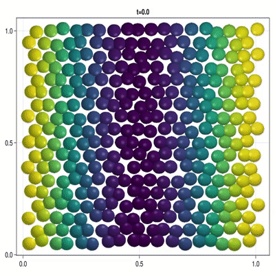

# CellBasedModels.jl

[](https://dsb-lab.github.io/CellBasedModels.jl/stable/)
[](https://dsb-lab.github.io/CellBasedModels.jl/dev/)

The CellBasedModels.jl package aims to help fast-designing and simulation of agent-based models whit possibilities to be run in CPU and NVidia GPUs for the efficient computation of large-scale systems. 

The following methods can be implemented in the model:

 - ODEs
 - SDEs
 - Division
 - Death
 - Coupling to continuum models evolving with PDEs
 - Random events

Check the 
Examples to get an idea of the capabilities of the package.

## Installation

Hopefully, soon we will make an official release in the Julia repository. For now, you can install the package from Github as:

```julia
julia> using Pkg
julia> Pkg.add(https://github.com/dsb-lab/CellBasedModels.jl)
```

or from the Pkg REPL

```julia
pkg> add https://github.com/dsb-lab/CellBasedModels.jl
```

## Examples

||||||
|---|---|---|---|---|
|**Patterning**|**ICM Development**|**Particle Aggregation**|**Bacterial Colony Growth**|**Bacterial Chemotaxis**|
||||||

## Current Limitations

At the present stage of development, the library is not capable of working on batches of data. That means that the size of the simulated models will be limited by the memory disponibility in RAM or the GPU, depending on the platform in which the simulations are being tested. 

Moreover, we can only use GPUs from NVidia as the GPU implementation is based on CUDA.jl.

## Future work

We intend to extend the current version of the package with additional capabilities. Any help is welcome!

### Short term 

 - Addition of coupling to continuum systems.
 - Additions of inactive agents to make arbitrary shape boundaries.
 - Add more examples
 - Increase the number of implemented models.

### Long term goals

 - Extend GPU capabilities to be used also in other packages.
 - Make optimization methods distributable among different CPU/GPUs.