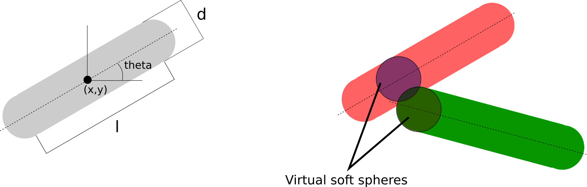
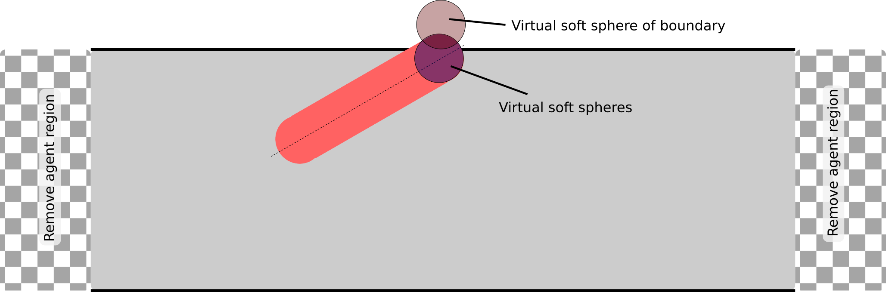

# Implemented Models

Several models are already implemented in the AgentBasedModels. You can use them by calling

```julia
Models.NameOfModel
```

and introduced them in custom made models with the `BaseModel` tag. e.g.

```
@agent(2,
    Models.Bacteria2D::BaseModel,

    custompart...
)
```

## Bacteria2D

Model of physical interactions for bacteria modeled as 2D rod-shape like cells.
This implementation follows the model of [Volfson et al.](https://www.pnas.org/content/105/40/15346)

```@raw html

```

The forces that the rods feel are computed by the closest virtual spheres in contact. For a rod of mass $m$.

```math
\bold{f}_{ij}=f_n\bold{n}_{ij}+f_t\bold{v}_t
```

where ``\bold{n}_{ij}`` if the normal vector between between the center of the spheres, defined as ``\bold{n}_{ij}=(\bold{r}_i-\bold{r}_j)/r_{ij}``; and the normal and tangential forces are defined as

```math
\begin{aligned}
f_n &= k_n\delta^{3/2}-\gamma_n \frac{m}{2}\delta v_n\\
f_t &= -\min(\gamma_t\frac{m}{2}\delta^{1/2},\mu_{cc}f_n)
\end{aligned}
```

and ``\delta=d-r_{ij}``, ``v_n=\bold{v}_{ij}·\bold{n}_{ij}`` and ``\bold{v}_t=\bold{v}_{ij}-v_n\bold{n}_{ij}``.

The equations of for a bacteria ``i`` are given by

```math
\begin{aligned}
m\ddot{\bold{r}_i} &= \sum_s\bold{f}_{s}-\beta m \bold{v}\\
\bold{I}·\dot{\bold{\omega}}_i &= \sum_s(\bold{r}_s-\bold{r_i})\times\bold{f}_s - \beta_\omega\omega
\end{aligned}
```

where ``s`` denotes for the sum over the virtual interacting spheres acting on bacteria $i$ and $\bold{i}$ is the tensor of inertia of a cylinder.

### Bacteria2DChannel

Model written over Bacteria2D with the added implementation of a closed boundary at the Y-limits and cells are revomed at the X-limits. The limits are imposed by the `simulationBox` property of the `Community` object. This implementation follows the model of [Volfson et al.](https://www.pnas.org/content/105/40/15346)

```@raw html

```
