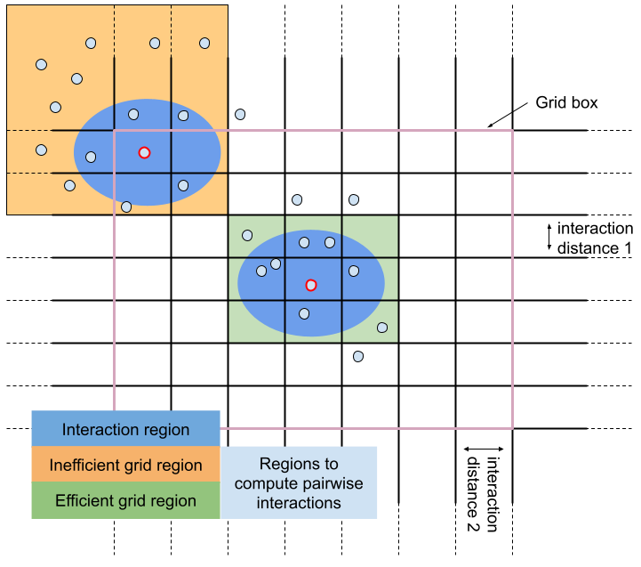

# Usage

In the steps we will go over the steps for constructing and evolving an agent based model.

## Defining Agent Properties

The creation of models is based on the macro `@agent`.

The unique parameter compoulsory required by the agent model is the dimensionality of the agent.

```julia
m = @agent(dims)
```

When defining the dimensions of the agent, some parameters will be added by default. These are the position paremeters of the agents depending on the spatial dimensionality and are considered **Local parameters**.

|dims=0|dims=1|dims=2|dims=3|
||`x`|`x`,`y`|`x`,`y`,`z`|

And the `id` parameter that defines the identity of the agent and is considered an **Identity parameter**.

In addition to specify the dimensions, there are three types of pieces of code that can be included in the model:

 - **Parameters**: All the properties of the agents and the model in general.
 - **Updates**: Set of rules that change the parameters of the agent model.

For now, the following methods are included:

|Type|Methods|Special symbols|Operators|Properties|
|:---|:---|:---|:---|:---|
|[**Parameters**](@ref parameters)|Local||||
||Identity||||
||Interaction||||
||Global||||
||GlobalInteraction||||
||GlobalArray||||
||Medium||||
||MediumBoundary||||
|[**Updates**](@ref updates)|[UpdateLocal](@ref updateLocal)||`addAgent`,`removeAgent`||
||[UpdateGlobal](@ref updateGlobal)||||
||[UpdateVariable](@ref equation)|`dt`,`dW`|`d`||
||[UpdateInteraction](@ref updateInteraction)|||`.i`,`.j`|
||[UpdateMedium](@ref updateMedium)||`∂t`,`∇x`,`∇y`,`∇z`,`Δx`,`Δy`,`Δz`,`δx`,`δy`,`δz`,
||||`periodicX`,`periodicY`,`periodicZ`,||
||||`newmannXmin`,`newmannYmin`,`newmannZmin`,
||||`newmannXmax`,`newmannYmax`,`newmannZmax` ||
||||`dirichletXmin`,`dirichletYmin`,`dirichletZmin`,||
||||`dirichletXmax`,`dirichletYmax`,`dirichletZmax` ||
||[UpdateMediumInteraction](@ref updateMediumInteraction)||||

### [Parameter declaration](@id parameters)

With this special characters, we define all the parameters that a model may have.

 - **Local**: These are continuous parameters that are assigned independently to each agent.
 - **Identity**: These parameters are discrete parameters that are assigned to a each agent.
 - **Interaction**: These parameters are local continuous parameters that are set to zero before each iteration.
 - **Global**: Parameters that are shared by all the agents.
 - **GlobalInteraction**: These parameters are globalcontinuous parameters that are set to zero before each iteration.
 - **GlobalArray**: Parameters in terms of array formats that are shared by all agents.
 - **Medium**: Parameters that form part of a continuous medium the agents are emdedded in.
 - **MediumBoundary**: Properties that define how the boundary behaves during the simulation.

The parameters can be declared individually or collect them in an array declaration.

```julia
m = @agent(dims,
    local1::Local,
    local2::Local,

    id1::Identity,
    id2::Identity,

    glob1::Global,
    glob2::Global,

    array1::GlobalArray,
    array2::GlobalArray,

    medium1::Medium,
    medium2::Medium
)
```
or equivalently,

```julia
m = @agent(dims,
    [local1,local2]::Local,

    [id1,id2]::Identity,

    [glob1,glob2]::Global,

    [array1,array2]::GlobalArray,

    [medium1,medium2]::Medium
    [xMinBoundary,xMaxBoundary....]::MediumBoundary
)
```

!!! warning "Reserved symbols"
    All the agents already include a few parameters by default that cannot be used as parameter names as they are already incorporated in the program:
     - **[x,y,z]::Local**: Position arguments of the agent.
     - **id::Identity**: Identification number of each agent.
     - **t::Global**: Absolute time of the model incremented at each integration step.
     - **dt::Global**: Step of the time integration.
     - **dW::Local**: Step of the Stochastic integration.
     - **N::Global**: Number of particles in the model at the present time.
     - **simulationBox::GlobalArray**: Box of dimensions ``(dims,2)`` defining the simulation space.
     - **radiumInteraction::GlobalArray**: Array of dimensions ``(dims)`` defining the maximum of interaction of an agent.

    Although this variables can be accessed freely by the programer, it is only advised to use them as **read only** parameters and not modify them for the correct evolution of the program. The program will inerently use and modify them when evolving the system.

!!! tip "Parameter Names"
    In principle, except for a handful of restricted parameter names that are used internally, any parameter name can be used. However, AgentBasedModels.jl works with a reasonable amount of metaprograming and, although it has been throughfully tested, it can have some unexpected behaviours depending on how to declare variables. It is advised to follow these not-too-restrictive guidelines for being extremely safe:
     - Define parameters with starting lower-case format (`variable` instead of `Variable`). As in the Julia guidelines these variables are by convention for Modules and Structures.
     - Avoid finishing the variable name with an underscore (`variable` instead of `variable_`). As in the Julia guidelines these variables are by convention private variables.
    It shouldn't be a problem at all and you can be perfectly skiping those recomendations, really, but code is never bullet proof and for sure will avoid unexpected and nasty bugs in that very rare situation when the program crashes for some unpredicted reason.

### [Updating rules](@id updates)

All the declared parameters of the model and of each agent may change in time. For that, we use Update rules. All update rules are defined as:

```julia
m = @agent(dims,

    Update_type = SOMERULE

)
```
if is a very simple rule that can be put in a line, or

```julia
m = @agent(dims,

    Update_type = begin
        SOMERULES
    end
)
```

#### [**UpdateLocal**](@id updateLocal)
Includes updates that will be performed at every time step on each agent independently. In this cell you can include agents or remove them using the corresponding operators.

Example: Dividing agent
```julia
m = @agent(2,
    [local1,tSplit]::Local,
    parent::Identity,

    UpdateLocal = begin
        if local1 > t #At each step, check if local1 is over the time and if so, increase the step.
            local1 += Uniform(1,2)
            if t > tSplit #Make a division event.
                addAgent( #Add one agent with a sifth in the x axis
                    x = x+0.5,
                    y = y,
                    local1 = local1,
                    tSplit = t + Uniform(1,2),
                    parent = id
                    )
                addAgent( #Add a second agent with a sifth in the x axis
                    x = x-0.5,
                    y = y,
                    local1 = local1,
                    tSplit =  + Uniform(1,2)
                    parent = id
                    )
                removeAgent() #Remove original agent
            end
        end
    end
)
```

#### [**UpdateGlobal**](@id updateGlobal)
Includes updates that will be performed at every time step on the global scope. In this cells you can modify **Global** scalars and **GlobalArrays**.

 Example.
```julia
m = @agent(0,
    glob1::Global,
    globA1::GlobalArray,

    UpdateGlobal = begin
        glob1 += dt
        globA1[1,1] += 3 
    end
)
```

#### [**UpdateVariable**](@id equation)
Specific local update rule for the definition of ODE ans SDE systems of equations governing the dynamics of the agents. UpdateVariables accept both ODE and SDE systems of equations. Each equation is defined by using the special operator `d` acting over the differential variable, `dt` for deterministic component and `dW` for the stochastic term.

Example: Consider a 2D [Ornstein–Uhlenbeck process](https://en.wikipedia.org/wiki/Ornstein%E2%80%93Uhlenbeck_process) with asymmetric difussivity. The system of equations would look like:

$$dx = -xdt + \sqrt{D_x}dW$$
$$dy = -ydt + \sqrt{D_y}dW$$

```julia
m = @agent(2,
    [Dx,Dy]::Global,

    UpdateVariable = begin
        d(x) = -x*dt + sqrt(Dx)*dW
        d(y) = -y*dt + sqrt(Dy)*dW
    end
)
```

#### [**UpdateInteraction**](@id updateInteraction)
Define the rules of interacting terms and other rules of interaction between agents. The difference with the UpdateLocalInteraction rules is that these interactions will be computed for every intermediate step of the integrtion rule (Euler integration a one step integrator, Heun's method uses two evaluations before computing the final step). The same notation as for the UpdateLocalInteraction applies here.

 Consider the example of a dynamical system consisting of interacting particles of the form:

$$\dot{x}_i = g + l_i + \sum_jf(x_i,x_j)$$
where $x$ is a variable, $g$ a global parameter, $l$ is a local parameter, and $sum_j f(x_i,x_j)$ is a sum over the pairwise forces between particles. The sum contracts the index $j$, so the contribution of interactions are effectively defined by a local parameter $int_i=\sum_jf(x_i,x_j)$. The update of the local parameter $int_i$ will be defined as an interaction term.

```julia
m = @agent(1,
    [l]::Local,
    [int]::Interaction
    [g]::Global,

    UpdateVariable = begin
        d(x) = g*dt + l*dt + int*dt
    end

    UpdateInteraction = begin
        int.i += f(x.i,x.j)
    end
)
```

#### [**UpdateMedium**](@id updateMedium)
Define the dynamics of the medium components. The medium dynamics are described with partial differential equations of reaction-drift-diffussion models.
the agents read the parameters of the medium at their point coordinates as if they where puntual particles in their coordinates.
The medium can also interact with the agents, with the agents throwing stuff into the medium with the declaration of [UpdateMediumInteraction rules](@ref updateMediumInteraction)

Consider the example that we want a one dimensional model of a medium that is diffusive of a compunent `u`, 
has a puntual source of input in the medium and general degradation everywhere. The agents move diffussively 
too but its diffussion is faster or slower according to the concentration of `u`.

```julia
m = @agent(3,
    u::Medium,
    [α,k]::Global,

    UpdateVariable = d(x) = u*dW

    UpdateMedium = begin
        #Add equation governing the dynamics of the medium
        ∂t(u) = Δx(u) + α*δx(0.) - k*u

        #Add boundary conditions
            #Periodic boudaries
        periodicX(u)
            #Fixed boundaries
        dirichletYmin(u) = 0
        dirichletYmax(u) = 1
            #Reflective boundaries
        newmannZmin(u) = 1
        newmannZmax(u) = -1
    end
)
```

!!! warning "Stability of solutions"
    This package is not a package for solving partial differential equations. PDEs are a hole world and it is impossible to make a bulletproof integrator to solve any partial differential equation. We restrict the use to reaction-drift-diffussion models, that are the most reasonable situation for an agent based model in a medium. Even in this case, a stable solution is not waranteed as the integrators so far implemented are not unconditionally stable. You can see a table of integrators implemented and their recomended use in [here](@ref MediumIntegrators).

## Compilation

Once defined the model and the space, the model is ready to be compiled into the full model program. For that we use the function 'compile' which will take all the pieces of information of the Agent and Space and the model and construct a compiled model with an evolution function ready to be used. The optional arguments can be checked at the [API](@ref API).

The outcome of `compile` is a compiled model with the specifications indicated that can be used for constructing initial conditions of the model (Communities) and evolving the system.

There are several properties of the compilation function you may choose from.
### Neighbors

Depending of the type of simulation we can sum over the interacting agents in different ways. Choosing the correct algorithm can highly improve the computation time. For the moment, there is two possible algorithms for computing neighbors.

| Nighbour algorithms | Good for simulations | Required parameters | Optional parameters |
|---|:---:|:---:|---|
| `full` | Unbounded simulations , Small bounded simulations, All-to-all interactions | None | Array with bounds (1D-3D) |
| `grid` | Bounded simulations, Large bounded simulations, Local interactions | Array with bounds (1D-3D), Distance of interaction | None |

!!! info "A bit deeper insight in simulation space methods"
    **SimulationFree** uses brute force and computes the interaction between all the pair of particles, hence being its computation complexity of $N^2$. This is the way to go when all the particles are interacting with each other at all times. The method is straighforward and does not require additional memory to compute anything. Because of its simplicity, it may be also more efficient than more convolute methods as the one of the simulation grid method for small scale systems even when the particles interact only locally.\
    **SimualtionGrid** bases considers that only agents in a neighbourhood of each agent are interacting at each time. For that purpose, the algorithms assigns each agent to a grid cell in a first step, and in a second step, it only computes the pairwise interactions of each agent with the agents in surrounding grid cells (see orange and green grid regions in the image below). When the system if big and many agents are not interacting with each other, this algorithm highly reduces the complexity of the interaction computation as $~N$ at the cost of an additional step of assigning to a cell. The algorithm requires additional memory as it has to keep trtack of the agent cell positions. Because of how the algorithm works, although the algorithm works in unbounded spaces, the methods is only efficient when the simulation happens in a limited region of a space where the simulation grid is defined (see difference between inefficient and efficient grid regions), returning to $N^2$ computations outside the grid.\
    

### [**Integrator**](@id Integrators)

The equations of motion defined in `UpdateVariable` can be integrated with for the moment with two different explicit methods.

| Integration algorithm | Accuracy | Stability |
|---|:---:|:---:|
| `Euler` | $\mathcal{O}(\Delta t)$ | $\lambda < 1$ |
| `Heun` | $\mathcal{O}(\Delta t^2)$ | $\lambda < 1$ |
| `ImplicitEuler` | $\mathcal{O}(\Delta t)$ | unconditionally stable* | 

*Because the method is implicit, a solver has to be used to solve the implicit system of equations. A iterative algorithm is used for that purpose that has a conditional convergence to the solution. This efectively adds some constraint to the stability regime. To control the convergence properties, you can tune the learning rate of the algorithm when running the algorithm with the parameter `learningRateIntegrator` in the `kwargs` of the model's `evolve` function.
### [**MediumIntegrator**](@id MediumIntegrators)

The equations of motion defined in `UpdateMedium` can be integrated with for the moment with two different explicit methods.

| Integration algorithm | Good for | Stability | Accuracy | Caution |
|---|:---:|:---:|:---:|:---:|
| `FTCS` | Diffussion and advection-diffusion equations of the form $$\partial_t u(x,t) =  \alpha(u) \partial_{xx} u(x,t) + f(u,t) $$ $$\partial_t u(x,t) = \beta(u) \partial_{x} u(x,t) +  \alpha(u) \partial_{xx} u(x,t) + f(u,t) $$ | $$\alpha(u) \Delta t/\Delta x^2 \leq 1/2$$ | $\mathcal{O}(\Delta t) + \mathcal{O}(\Delta x^2)$ | Unconditionaly unstable for advection-only equations. |
| `Lax` | Advection equations of the form $$\partial_t u(x,t) = \alpha(u) \partial_{x} u(x,t) + f(u,t)$$ | $$\|\alpha(u) \Delta t/\Delta x\| \leq 1$$ | $\mathcal{O}(\Delta t)+\mathcal{O}(\Delta x^2/\Delta t)$  | The stability makes the colution to be diffusive. |

### Platform

Choose between running the model in `cpu` or `gpu`. For small systems, the cpu can give better results, giving a increased speed of for big models in the gpu.

## Initialising the model: construction of an initial Community

With the model at hand, the only we are required is to define an initial condition for the model to be evolved. We use for that the `Community` structure. The community structure is an instantiation of an agent based model for a particular time that stores the information of all the global and local parameters of the model. 

For constructing a initial Community we just have to call the function and specify the number of agents that it should contain.

```julia
com = Community(modelCompiled,N=10)
```

with the community created we just have to assign the initial conditions to each agent, the constants and the medium if declared, and the simulation box. The parameters of the agent can be called directly from the Community.

Example,

```julia
m = @agent(2,
    [l1,l2]::Local,
    g::Global,
    id::Identity,
    gArray::GlobalArray,
    u::Medium
)
mComp = compile(m,platform="cpu",save="RAM",compile="RAM")

#Community creation
com = Community(mComp, N=10, mediumN=[20,20]) #Define a medium with a grid of 20x20
#Parameters assignment
com.l1 .= 3.
com.l2 .= [1,2,3,4,5,6,7,8,9,10]
com.g = 4
com.id .= 4
com.gArray = zeros(2,2) 

com.simulationBox = [-10 10;-10 10] #Define a square space
```

!!! tip "predefined initializations"
    Appart from the community, there are some initialization functions that create communities with already declared positions. Check [API Community Constructors](@ref APICommunityConstructors)

!!! warning "mediumN declaration"
    When a medium is declared, it is necessary to declare the parameter `mediumN` specifying the size of the grid.

!!! warning "simulationBox declaration"
    When a bounded space is declared, it is necessary to define the community parameter `simulationBox` specifying the size of the simulation space. Moreover, the position of the agents (the parameters `x`, `y`, `z`) would have to lay inside the simulationBox space.

## Evolving the model

With a model and an initial Community, we can evolve the system with the function `evolve`, a property of the compiled community.

```julia
modelCompiled.evolve(com,dt=0.1,tMax=10.)
```

Depending on the choice of saving properties, the evolve function will return a `CommunityInTime` object, which is an array of Communities with the saved steps in the evolution or will return nothing, in case the data is saved in the hard drive.

## Optimizing the parameters

In many cases, we are interested in fitting the algorithm to some data. For that, we need to optimize the parameters of our model. The package areadly incorporates many algorithms that can be used for the optimization of agent based models.
## Debugging Tips

In the compile stage, all of this definitions of parameters, rules, etc. are internally managed to be vectorized and construct a custom made evolution function. All this transformations are performed under deep use of Metaprogramming and return a function that is evaluated in the compiled model under `compiledModel.evolve` property. Moreover, the compiled function is saved as an Expression in the property `compiledModel.program`.

If when running a the `evolve` function in a community, the program chrashes, it is possible to have a clue on when the program has failed by printing the program and checking the trace of the error.

```julia
println(compiledModel.program)
```

The program you will see is pretty long an ugly but if you look into detail the program structure is pretty intuitive and follows the following structure:

```
function (arguments of evolve)

    VECTOR DECLARATION (Vectorized form of all the parameters in the community and auxiliar functions)

    FUNCTION DECLARATION (Intermediate function calls to all the functions employed in each step, the names of the functions are pretty straighforward to understand)

    while t<tMax
        Code calling to the functions required for each time step
    end

    return nothing/CommunityInTime
end
```

Looking for the error will tell you what is the possible mistake in the program declaration. Here I comment several sources of error that are the most common causes of error:

Some errors are GPU defined and usually disappear if you change the compilation platform from `"cpu"` to `"gpu"`. These errors may be caused by:
 - **GPU user defined function incompatibility**: If using functions that do not belong to the `Core` and `Distributions` libraries, it is possible that GPU kernels are not able to call them. Check that they are properly declared to be gpu compatible.
 - **Vectorizes "dot" operators**: Make sure you do not use any element-by-element operations. The system is in charge of vectorizing for you and my run into problems if you put some "dot" somewhere.

The other more conventional errors that are platform independent may be caused by:
 - **Type error**: Make sure that functions that when modifying identity parameters you use Int values.
 - **Auxiliar variables declaration**: Make sure that you do not declare an auxiliar variable with the same name of a parameter of the model.  
 - **Global Array accessed at index out of bounds**: By defauls, you can make the global Arrays any shape you want. The drawback of this is that the program do not check its dimensions and you can be accessing an index out of bounds. 
 - **Memory out of bounds**: When using events, it it possible that you create more cells than `nMax` you have declared. Make sure that you set an appropiate upper bound for the system not to crash when evolving.