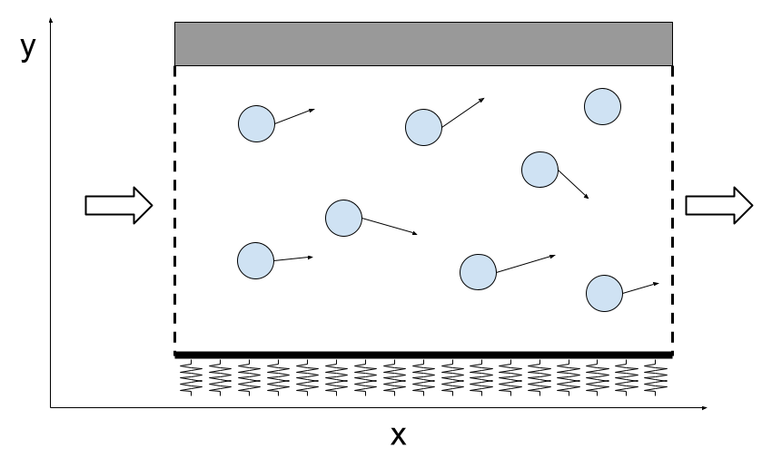

# Usage

In the steps we will go over the steps for constructing and evolving an agent based model.

## Defining Agent Properties

The creation of models is based on the macro `@agent`.

The unique parameter compoulsory required by the agent model is the dimensionality of the agent.

```julia
m = @agent(dims)
```

The agent will add by default the position paremeters of the agents depending on the spatial dimensionality.

|dims=0|dims=1|dims=2|dims=3|
||`x`|`x`,`y`|`x`,`y`,`z`|

In addition to specify the dimensions, there are three types of pieces of code that can be included in the model:

 - **Parameters**: All the properties of each agent and the model.
 - **Updates**: Set of rules that change the parameters of the agent model.
 - **Events**: Set of rules that change the total number of agents in the model.

For now, the following methods are included:

|Type|Methods|Special symbols|Operators|
|:---|:---|:---|:---|
|[**Parameters**](@ref parameters)|Local|||
||Identity|||
||Global|||
||GlobalArray|||
||Medium|||
|[**Updates**](@ref updates)|[UpdateLocal](@ref updateLocal)|||
||[UpdateGlobal](@ref updateGlobal)|||
||[Equation](@ref equation)|`dt`,`dW`|`d_`|
||[UpdateLocalInteraction](@ref updateLocalInteraction)||`_i`,`_j`|
||[UpdateInteraction](@ref updateInteraction)||`_i`,`_j`|
||[UpdateMedium](@ref updateMedium)||`∂t_`,`∇x`,`∇y`,`∇z`,`Δx`,`Δy`,`Δz`,`δ`|
||[UpdateMediumInteraction](@ref updateMediumInteraction)|||
|[**Events**](@ref events)||||
||[EventDeath](@ref eventDeath)|||
||[EventDivision](@ref eventDivision)||`_1`,`_2`|

### [Parameter declaration](@id parameters)

With this special characters, we define all the parameters that a model may have.

 - **Local**: These are continuous parameters that are assigned independently to each agent.
 - **Identity**: These parameters are discrete parameters that are assigned to a each agent.
 - **Global**: Parameters that are shared by all the agents.
 - **GlobalArray**: Parameters in terms of array formats that are shared by all agents.
 - **Medium**: Parameters that form part of a continuous medium the agents are emdedded in.

The parameters can be declared individually or collect them in an array declaration.

```julia
m = @agent(dims,
    local1::Local,
    local2::Local,

    id1::Identity,
    id2::Identity,

    glob1::Global,
    glob2::Global,

    array1::GlobalArray,
    array2::GlobalArray,

    medium1::Medium,
    medium2::Medium
)
```
or equivalently,

```julia
m = @agent(dims,
    [local1,local2]::Local,

    [id1,id2]::Identity,

    [glob1,glob2]::Global,

    [array1,array2]::GlobalArray,

    [medium1,medium2]
)
```

!!! warning "Already Declared Parameters"
    All the agents already include a few parameters by default that can be used:
     - **t::Global**: Absolute time of the model incremented at each integration step.
     - **dt::Global**: Step of the time integration.
     - **dW::Local**: Step of the Stochastic Term.
     - **N::Global**: Number of particles in the model at the present time.
     - **idAgent::Identity**: Identification number of each agent.

    Although this variables can be accessed freely by the programer, it is only advised to use them as **read only** parameters and not modify them for the correct evolution of the program. The program will inerently use and modify them when evolving the system.

!!! tip "Parameter Names"
    In principle, except for a handful of restricted parameter names that are used internally, any parameter name can be used. However, AgentBasedModels.jl works with a reasonable amount of metaprograming and, although it has been throughfully tested, it can have some unexpected behaviours depending on how to declare variables. It is advised to follow these not-too-restrictive guidelines for being extremely safe:
     - Define parameters with starting lower-case format (`variable` instead of `Variable`). As in the Julia guidelines these variables are by convention for Modules and Structures.
     - Avoid finishing the variable name with an underscore (`variable` instead of `variable_`). As in the Julia guidelines these variables are by convention private variables.
    It shouldn't be a problem at all and you can be perfectly skiping those recomendations, really, but code is never bullet proof and for sure will avoid unexpected and nasty bugs in that very rare situation when the program crashes for some unpredicted reason.

### [Updating rules](@id updates)

All the declared parameters of the model and of each agent may change in time. For that, we use Update rules. All update rules are defined as:

```julia
m = @agent(dims,

    Update_type = SOMERULE

)
```
if is a very simple rule that can be put in a line, or

```julia
m = @agent(dims,

    Update_type = begin
        SOMERULES
    end
)
```

#### [**UpdateLocal**](@id updateLocal)
Includes updates that will be performed at every time step on each agent independently.

Example.
```julia
m = @agent(dims,
    local1::Local,

    UpdateLocal = begin
        if local1 > t #At each step, check if local1 is over the time and if so, increase the step.
            local1 += Uniform(1,2)
        end
    end
)
```

#### [**UpdateGlobal**](@id updateGlobal)
Includes updates that will be performed at every time step on each agent independently.

 Example.
```julia
m = @agent(dims,
    glob1::Global,
    globA1::GlobalArray,

    UpdateGlobal = begin
        glob1 += dt
        globA1[1,1] += 3 
    end
)
```

#### [**Equation**](@id equation)
Specific local update rule for the definition of ODE ans SDE systems of equations governing the dynamics of the agents. Equations accept both ODE and SDE systems of equations. Each equation is defined by using the special symbols `d_` in front the the differential variable, `dt` for deterministic component and `dW` for the stochastic term.

 Example: Consider a 2D [Ornstein–Uhlenbeck process](https://en.wikipedia.org/wiki/Ornstein%E2%80%93Uhlenbeck_process) with asymmetric difussivity. The system of equations would look like:

$$dx = -xdt + \sqrt{D_x}dW$$
$$dy = -ydt + \sqrt{D_y}dW$$

```julia
m = @agent(dims,
    [Dx,Dy]::Global,

    Equation = begin
        d_x = -x*dt + sqrt(Dx)*dW
        d_y = -y*dt + sqrt(Dy)*dW
    end
)
```

#### [**UpdateLocalInteraction**](@id updateLocalInteraction)
Define the rules for interacting agents one in each integration step. In these rules, local and identity parameters of two agents will be used. To differentiate the parameters of which agent we are using, we use the notation `_i` to indicate the agent we are updating the rules and `_j` for the other agents interacting with the agent being updated. This notation resembles the notation of a contracting index $x_i=\sum_jx_{ij}$.

 Example, consider that an agent flips between an stressed or an unstressed state depending on the number of neighbours that it has around. We will define such a rule as,

```julia
m = @agent(dims,
    n::Identity, #Keep the number of neighbours
    stressed::Identity #0 not stressed, 1 stressed 

    UpdateLocalInteraction = begin
        if abs(x_i - x_j) < 3. #If agent j is in some neighbourhood of i
            n += 1
            if n > 5
                stressed = 1
            else
                stressed = 0
            end
        end
    end
)
```

!!! warning "Interaction Parameter Erasing Behaviour"
    By default, all local and identity **parameters that are modified using an [updating operator](https://docs.julialang.org/en/v1/manual/mathematical-operations/#Updating-operators) are set to zero** before the UpdateLocalInteraction and the UpdateInteraction rules happen.** This is intended as, in most part of the cases, want an continuous increase of the operator. In the example above, for example, we want to count every step how many neighbours we have with the parameter `n`, not that this increases every time.

    In case that we would like to not erase the parameter before the update rule, use instead the expanded version of the update operator** : `n = n + 1`. This will prevent the program to detect it as an interacting operator and will not erase it before the computation.


#### [**UpdateInteraction**](@id updateInteraction)
Define the rules of interacting terms and other rules of interaction between agents. The difference with the UpdateLocalInteraction rules is that these interactions will be computed for every intermediate step of the integrtion rule (Euler integration a one step integrator, Heun's method uses two evaluations before computing the final step). The same notation as for the UpdateLocalInteraction applies here.

 Consider the example of a dynamical system consisting of interacting particles of the form:

$$\dot{x}_i = g + l_i + \sum_jf(x_i,x_j)$$
where $x$ is a variable, $g$ a global parameter, $l$ is a local parameter, and $sum_j f(x_i,x_j)$ is a sum over the pairwise forces between particles. The sum contracts the index $j$, so the contribution of interactions are effectively defined by a local parameter $int_i=\sum_jf(x_i,x_j)$. The update of the local parameter $int_i$ will be defined as an interaction term.

```julia
m = @agent(dims,
    [l,int]::Local,
    [g]::Global,

    Equation = begin
        d_x = g*dt + l*dt + int*dt
    end

    UpdateInteraction = begin
        int_i += f(x_i,x_j)
    end
)
```

#### [**UpdateMedium**](@id updateMedium)
Define the dynamics of the medium components. The medium dynamics are described with partial differential equations of reaction-drift-diffussion models.
the agents read the parameters of the medium at their point coordinates as if they where puntual particles in their coordinates.
The medium can also interact with the agents, with the agents throwing stuff into the medium with the declaration of [UpdateMediumInteraction rules](@ref updateMediumInteraction)

    Consider the example that we want a one dimensional model of a medium that is diffusive of a compunent `u`, 
    has a puntual source of input in the medium and general degradation everywhere. The agents move diffussively 
    too but its diffussion is faster or slower according to the concentration of `u`.

```julia
m = @agent(1,
    u::Medium,
    [α,k]::Global,

    Equation = d_x = u*dW

    UpdateMedium = begin
        ∂_u = Δx(u) + α*δx(0.) - k*u
    end
)
```

!!! warning "Stability of solutions"
    This package is not a package for solving partial differential equations. PDEs are a hole world and it is impossible to make a bulletproof integrator to solve any partial differential equation. We restrict the use to reaction-drift-diffussion models, that are the most reasonable situation for an agent based model in a medium. Even in this case, a stable solution is not waranteed as the integrators so far implemented are not unconditionally stable. You can see a table of integrators implemented and their recomended use in [here](@ref MediumIntegrators).


#### [**UpdateMediumInteraction**](@id updateMediumInteraction)
Define the interaction dynamics from the agents to the medium. The agents behave as punctual particles centered at their main coordinates `(x,y,z)`. 
The effect of the interaction would effectivaly look as an additional term in the PDE summing over the agents:

$$
\partial_u(x) = \sum_{i\in Agents} \delta(x) f(\text{Agent i Parameters})
$$

    Consider the example that we want a one dimensional model of a medium that is diffusive of a compunent `u`, 
    the agents act as puntual source of input in the medium and general degradation everywhere. The agents move diffussively.

```julia
m = @agent(1,
    u::Medium,
    α::Local,
    k::Global,

    Equation = d_x = u*dW

    UpdateMedium = begin
        ∂_u = Δx(u) - k*u
    end

    UpdateMediumInteraction = begin
        ∂_u += α
    end
)
```

### [Events](@id events)

Events are rules that change the total number of agents in a simulation.

#### [**EventDeath**](@id eventDeath)

Define the rule in order to remove an agent from the model. The rule should be and boolean rule.

 Example: Consider agents that have a finite lifespan, after which they are removed from the system.

```julia
m = @agent(dims,
    tDeath::Local,

    EventDeath = t > tDeath #When time is over time of death, remove the cell
)
```

#### [**EventDivision**](@id eventDivision)

Define a rule in order to divide an agent in two. In order to differentiate the different agent daughters properties, use the markers `_1` and `_2`.

 Example: Consider that an agent has a orientation in the polar plane. When dividing it in two, the daughters choose a random direction of orientation and divide.

```@raw html

```

 ```julia
m = @agent(dims,
    [x,y]::Local, #Position sphere
    r::Local,     #Radius sphere
    tDiv::Local,  #Time division

    EventDivision = begin
        if tDiv > t
            #Usual algorithm to sample isotropically from a unit circle
            dx = Normal(0,1); dy = Normal(0,1); dTotal = sqrt(dx^2,dy^2); #Sample from a 2D isotropic gaussian distribution
            dx /= dTotal; dy /= dTotal; #Normalize the direction
            #Division rules
            x_1 += dx*r/2
            y_1 += dy*r/2
            x_2 -= dx*r/2
            y_2 -= dy*r/2
        end
    end
)
```

## Defining a Simulation Space

For some simulations, it is not necessary to define any simulation space. However, in many others it is convenient to bound the system to a definite region of the space. The definition of a simulation space will bound the system and will have an effect on the speed of the search for neighbours, that ussually is the most computational costly part of large system simulations.

### Simulation spaces

For the moment, there is two possible simulation spaces possible.

| Simulation Spaces | Good for simulations | Required parameters | Optional parameters |
|---|:---:|:---:|---|
| SimulationFree | Unbounded simulations , Small bounded simulations, All-to-all interactions | None | Array with bounds (1D-3D) |
| SimulationGrid | Bounded simulations, Large bounded simulations, Local interactions | Array with bounds (1D-3D), Distance of interaction | None |

See [Small Example](@ref simulationSpaceExample) for an illustrative example of how to define complex simulation spaces.

!!! info "A bit deeper insight in simulation space methods"
    **SimulationFree** uses brute force and computes the interaction between all the pair of particles, hence being its computation complexity of $N^2$. This is the way to go when all the particles are interacting with each other at all times. The method is straighforward and does not require additional memory to compute anything. Because of its simplicity, it may be also more efficient than more convolute methods as the one of the simulation grid method for small scale systems even when the particles interact only locally.\
    **SimualtionGrid** bases considers that only agents in a neighbourhood of each agent are interacting at each time. For that purpose, the algorithms assigns each agent to a grid cell in a first step, and in a second step, it only computes the pairwise interactions of each agent with the agents in surrounding grid cells (see orange and green grid regions in the image below). When the system if big and many agents are not interacting with each other, this algorithm highly reduces the complexity of the interaction computation as $~N$ at the cost of an additional step of assigning to a cell. The algorithm requires additional memory as it has to keep trtack of the agent cell positions. Because of how the algorithm works, although the algorithm works in unbounded spaces, the methods is only efficient when the simulation happens in a limited region of a space where the simulation grid is defined (see difference between inefficient and efficient grid regions), returning to $N^2$ computations outside the grid.\
    

### Boundaries

When defining models with boundaries, there are two possible boundaries that we can choose from. Boundaries can be choosen independently for each dimension. The boudnaries require a symbol of the model that indicates the which variable will be used as a boundary, a minimum value and a maximum value. In addition, when an agent crosses the boundary, we may want to define he behavior of crossing that boundary as additional parameters.

See [Small Example](@ref simulationSpaceExample) for an illustrative example of how to define complex simulation spaces.

| Boundary | Compulsory parameters | Optional parameters | Description of optional parameters |
|---|:---:|:---:|:---|
|Periodic|Parameter symbol, Min value, Max value | (All arrays) additional | Additional periodic parameters that will be modified when the boundary parameter crosses the boundary |
|Bound|Parameter symbol, Min value, Max value| (All arrays) stop, stopMin, stopMax, bounce, bounceMin, bounceMax, reflect, reflectMin, reflectMax| Modification conditions to parameters when the boundary parameter crosses theboundary |

### [Small Example](@id simulationSpaceExample)

Consider the artificial example of simulating a 2D pipe in which non-interacting elyptic particles flow in the $x$ direction, they get stuck in the upper pippe part and they bounce in the lower part, changing the direction of the velocity in the $y$ axis. The diagram of the boundaries would look like something like this:

```@raw html

```

The code would look like,

```julia
m = @agent(
    partilcesInAPippe,

    [x,y,x1,y1]::Local,   #Particle position and second positions
    [vx,vy]::Local, #Particle velocity
    driftx::Global, #Drift of the particles in the x direction
    diffussion::Global, #Drift of the particles in the x direction

    Equation = begin
        d_x = vx*dt
        d_y = vy*dt
        d_x1 = vx*dt
        d_y1 = vy*dt
    end
)

#Define the space, not necessary to define a Grid sinceparticles do not interact
space = SpaceFree(m,
        [
        Periodic(:x,0,10,addition=[x1]),
        Bound(:y,0,1,bounceMin=[:y],reflectMin[:vy],stopMax=[:y]
        ]
)

```

## Compilation

Once defined the model and the space, the model is ready to be compiled into the full model program. For that we use the function 'compile' which will take all the pieces of information of the Agent and Space and the model and construct a compiled model with an evolution function ready to be used. The optional arguments can be checked at the [API documentation](@ref APIcompilation).

The outcome of `compile` is a compiled model with the specifications indicated that can be used for constructing initial conditions of the model (Communities) and evolving the system.

## Initialising the model: construction an initial Community

With the model at hand, the only we are required is to define an initial condition for the model to be evolved. We use for that the `Community` structure. The community structure is an instantiation of an agent based model for a particular time that stores the information of all the global and local parameters of the model. 

For constructing a initial Community we just have to call the function and specify the number of agents that it should contain.

```julia
com = Community(modelCompiled,N=10)
```

with the community created we just have to assign the initial conditions to each agent. The parameters of the agent can be called directly from the Community.

Example,

```
m = @agent(dims,
    [l1,l2]::Local,
    g::Global,
    id::Identity,
    gArray::GlobalArray
)
mComp = compile(m,platform="cpu",save="RAM",compile="RAM")

#Community creation
com = Community(mComp, N=10)
#Parameters assignment
com.l1 .= 3.
com.l2 .= [1,2,3,4,5,6,7,8,9,10]
com.g = 4
com.id .= 4
com.gArray = zeros(2,2) 
```

## Evolving the model

With a model and an initial Community, we can evolve the system with the function `evolve`, a property of the compiled community.

```julia
modelCompiled.evolve(com,dt=0.1,tMax=10.)
```

Depending on the choice of saving properties, the evolve function will return a `CommunityInTime` object, which is an array of Communities with the saved steps in the evolution or will return nothing, in case the data is saved in the hard drive.

## Debugging Tips

In the compile stage, all of this definitions of parameters, rules, etc. are internally managed to be vectorized and construct a custom made evolution function. All this transformations are performed under deep use of Metaprogramming and return a function that is evaluated in the compiled model under `compiledModel.evolve` property. Moreover, the compiled function is saved as an Expression in the property `compiledModel.program`.

If when running a the `evolve` function in a community, the program chrashes, it is possible to have a clue on when the program has failed by printing the program and checking the trace of the error.

```julia
println(compiledModel.program)
```

The program you will see is pretty long an ugly but if you look into detail the program structure is pretty intuitive and follows the following structure:

```
function (arguments of evolve)

    VECTOR DECLARATION (Vectorized form of all the parameters in the community and auxiliar functions)

    FUNCTION DECLARATION (Intermediate function calls to all the functions employed in each step, the names of the functions are pretty straighforward to understand)

    while t<tMax
        Code calling to the functions required for each time step
    end

    return nothing/CommunityInTime
end
```

Looking for the error will tell you what is the possible mistake in the program declaration. Here I comment several sources of error that are the most common causes of error:

Some errors are GPU defined and usually disappear if you change the compilation platform from `"cpu"` to `"gpu"`. These errors may be caused by:
 - **GPU user defined function incompatibility**: If using functions that do not belong to the `Core` and `Distributions` libraries, it is possible that GPU kernels are not able to call them. Check that they are properly declared to be gpu compatible.
 - **Vectorizes "dot" operators**: Make sure you do not use any element-by-element operations. The system is in charge of vectorizing for you and my run into problems if you put some "dot" somewhere.

The other more conventional errors that are platform independent may be caused by:
 - **Type error**: Make sure that functions that when modifying identity parameters you use Int values.
 - **Auxiliar variables declaration**: Make sure that you do not declare an auxiliar variable with the same name of a parameter of the model.  
 - **Global Array accessed at index out of bounds**: By defauls, you can make the global Arrays any shape you want. The drawback of this is that the program do not check its dimensions and you can be accessing an index out of bounds. 
 - **Memory out of bounds**: When using events, it it possible that you create more cells than `nMax` you have declared. Make sure that you set an appropiate upper bound for the system not to crash when evolving.