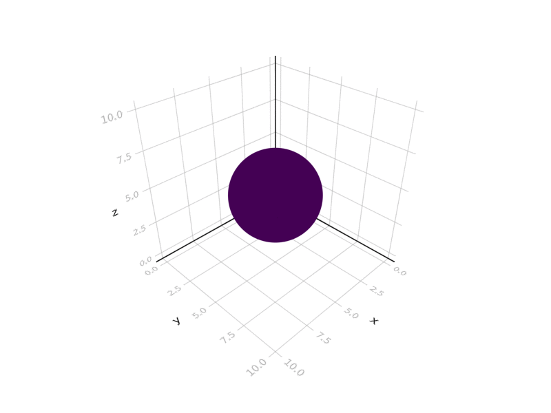
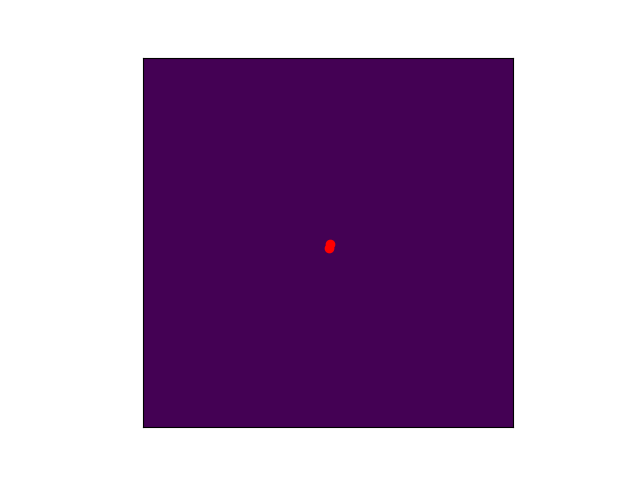

The AgentBasedModels.jl package aims to help fast designing and simulation of Agent Based models whith possibilities to be run in CPU and NVidia GPUs for the efficient computation of large scale systems. Implementing a julia 

The following methods can be implemented in the model:

 - ODEs
 - SDEs
 - Division events
 - Death events
 - Boundary conditions
 - Random events

## Installation

For now, the only way of installing the library is by cloning the project. Hopefully soon we will make an official release in the Julia repository.

```julia
julia> using Pkg
julia> Pkg.add(https://github.com/dsb-lab/AgentBasedModels.jl)
```

or from the Pkg REPL

```julia
(v1.6) pkg> add https://github.com/dsb-lab/AgentBasedModels.jl
```

## Examples

|Embryogenesys|Medium|
|:---:|:---:|
|[](@ref saiz)|[](@ref medium)|

## Limitations

To the present stage of the development, the limitations, the library is not capable of working on batches of data. That means that the size of the simulated models will be limited by the memory disponibility in RAM or the GPU, depending on the platform in which the simulations are being tested.

## Alternative libraries and software

Many differents softwares have been developed for constructing Agent Based Models. 

Non-Julia based specific software:
 - [NetLogo](https://ccl.northwestern.edu/netlogo/) it is mostly focused for discrete dynamics. It is a bit outdated.
 - [Mason](https://cs.gmu.edu/~eclab/projects/mason/) Develop in Java, it is discrete step based software.

Non-Julia based generic software:
 - [ya||a](https://github.com/germannp/yalla) Software developed with CUDA/C++. It is fast as it is fully parallellized but apart from already written models, that are specific for the study of limb morphogenesis, advance knowledge of CUDA and C++ are required for any customization. 
 - [Mesa](https://github.com/projectmesa/mesa) Software developed in Python with a very intuitive framework. It is specialized in discrete dynamics in grid spaces.

Julia based generic software:
 - [Agents.jl](https://github.com/JuliaDynamics/Agents.jl). To our knowledge, there is only one alternative package writen in Julia for the construction and deployment of agent based models. This library is very nice, really. It is a mature library and is the way to go for Agent Based Models in Julia for discrete time dynamics. As another agent based library, our library and the Agent.jl library overlap in some of the capabilities and both can construct models in continuous space with similar capabilities. We focus our library on the simulation of continuous spaces with continuous time that are described in terms of differential equations with the additional value of being able to escalate the system to escalate the system to large amounts of agents by simulating in CUDA. 