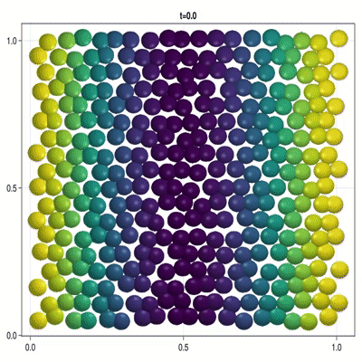
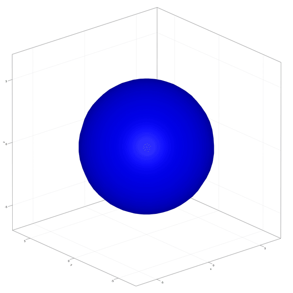
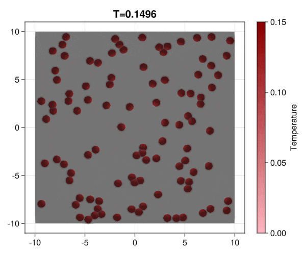

The CellBasedModels.jl package aims to help fast-designing and simulation of agent-based models whith possibilities to be run in CPU and NVidia GPUs for the efficient computation of large-scale systems. 

The following methods can be implemented in the model:

 - ODEs
 - SDEs
 - Division
 - Death
 - Coupling to continuum models evolving with PDEs
 - Random events

Check the 
Examples to get an idea of the capabilities of the package.

## Installation

Hopefully, soon we will make an official release in the Julia repository. For now, you can install the package from Github as:

```julia
julia> using Pkg
julia> Pkg.add(url="https://github.com/dsb-lab/CellBasedModels.jl")
```

or from the Pkg REPL

```julia
pkg> add https://github.com/dsb-lab/CellBasedModels.jl
```

## Examples

[**Patterning**](@ref Patterning)
```@raw html 
<table>
    <tbody>
        <tr>
            <td style="height:200px">
                Implementation of a patterning model as described by <a href="https://www.science.org/doi/full/10.1126/science.aai7407?casa_token=_HGoX7kcWZcAAAAA%3AzoEGS_8EyLf7hNo9MC274EuqPACq6y4MsfCr93S9tzmmcK3pSTmNpJ7a7sc8HQMw5PETz7n9tG15jQ">Corson et al. (2017)</a>.

                In this example you learn how to:
                <ul>
                    <li>Write a full model from scratcht.</li>
                    <li>Using external functions in your model.</li>
                    <li>Deal with periodic boundary conditions.</li>
                </ul>
            </td>
            <td>
                
            </td>
        </tr>
    </tbody>
</table>
```
[**ICM Development**](@ref Development)
```@raw html 
<table>
    <tbody>
        <tr style="height:200px">
            <td>
                Implementation of the development and commitment of the Inner Cell Mass of the embryo as proposed by <a href="https://elifesciences.org/articles/56079">Saiz et al. (2020)</a>.

                In this example you learn how to:
                <ul>
                    <li>Use predefined models as base for more complex models.</li>
                    <li>Extract data from the Community object.</li>
                    <li>Making division events.</li>
                    <li>Fit agent based models to data using the Fitting module.</li>
                </ul>
            </td>
            <td>
                
            </td>
        </tr>
    </tbody>
</table>
```
[**Particle Aggregation**](@ref Aggregation)
```@raw html 
<table>
    <tr>
    <tbody>
        <tr>
            <td style="height:200px">
                Implementation of brownian particles with addesion properties and chack the aggregation transition.

                In this example you learn how to:
                <ul>
                    <li>Write a full model from scratch and extend it.</li>
                    <li>Modifying global parameters.</li>
                    <li>Define boundary conditions.</li>
                </ul>
            </td>
            <td>
                
            </td>
        </tr>
    </tbody>
</table>
```
[**Bacterial Colony Growth**](@ref Bacteries)
```@raw html 
<table>
    <tbody>
        <tr>
            <td style="height:200px">
                Implementation of a bacterial interaction and growth model as described by <a href="https://www.pnas.org/doi/abs/10.1073/pnas.0706805105">Volfson et al. (2008)</a>.

                In this example you learn how to:
                <ul>
                    <li>Use predefined models as base for more complex models</li>
                    <li>Working with non-spherical agents.</li>
                    <li>Making division events.</li>
                </ul>
            </td>
            <td>
                
            </td>
        </tr>
    </tbody>
</table>
```
[**Bacterial Chemotaxis**](@ref Chemotaxis)
```@raw html 
<table>
    <tbody>
        <tr>
            <td style="height:200px">
                Modification of the bacterial interaction model as described by <a href="https://www.pnas.org/doi/abs/10.1073/pnas.0706805105">Volfson et al. (2008)</a> to be active bacteria with tumble-and-run dynamics and chemotaxis behavior.

                In this example you learn how to:
                <ul>
                    <li>Use predefined models as base for more complex models</li>
                    <li>Working with non-spherical agents.</li>
                    <li>Work with models coupled with a medium.</li>
                </ul>
            </td>
            <td>
                
            </td>
        </tr>
    </tbody>
</table>
```

## Current Limitations

At the present stage of development, the library is not capable of working on batches of data. That means that the size of the simulated models will be limited by the memory disponibility in RAM or the GPU, depending on the platform in which the simulations are being tested. 

Moreover, we can only use GPUs from NVidia as the GPU implementation is based on CUDA.jl.

## Future work

We intend to extend the current version of the package with additional capabilities. Any help is welcome!

### Short term 

 - Addition of coupling to continuum systems.
 - Additions of inactive agents to make arbitrary shape boundaries.
 - Add more examples
 - Increase the number of implemented models.

### Long term goals

 - Extend GPU capabilities to be used also in other packages.
 - Make optimization methods distributable among different CPU/GPUs.
 - 
## Alternatives to CellBasedModels.jl

Many different packages and programs have been developed for constructing agent-based models. 

Non-Julia-based specific software:
 - [NetLogo](https://ccl.northwestern.edu/netlogo/) is mostly focused on discrete dynamics. It is a bit outdated.
 - [Mason](https://cs.gmu.edu/~eclab/projects/mason/) Developed in Java, it is discrete-step-based software.

Non-Julia-based generic software:
 - [ya||a](https://github.com/germannp/yalla) Software developed with CUDA/C++. It is fast as it is fully parallelized but apart from already written models, that are specific for the study of limb morphogenesis, advanced knowledge of CUDA and C++ is required for any customization. 
 - [Mesa](https://github.com/projectmesa/mesa) is developed in Python with a very intuitive framework. It is specialized in discrete dynamics in grid spaces.

Julia-based generic software:
 - [Agents.jl](https://github.com/JuliaDynamics/Agents.jl). To our knowledge, there is only one alternative package written in Julia for the construction and deployment of agent-based models. It is a mature library and is the way to go for agent-based models in Julia for discrete-time dynamics. As another agent-based library, our library and the Agent.jl library overlaps in some of the capabilities and both can construct models in continuous space with similar capabilities. We focus our library on the simulation of continuous spaces with a continuous time that is described in terms of differential equations with the added value of being able to escalate the system to large amounts of agents by simulating in CUDA. 
